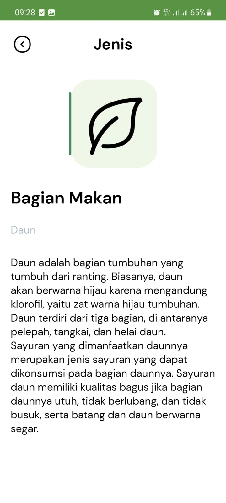

# VegeFinder Mobile

## Table of Contents

-   [Description](#descri[])
-   [Features](#features)
-   [Screenshots](#screenshots)
-   [Getting Started](#getting-started)
    -   [Prerequisites](#prerequisites)
    -   [Installation](#installation)
-   [Dependencies](#dependencies)
-   [License](#license)

## Description

VegeFinder is an application that helps young people who want to start farming. The mobile app built using android studio and using endpoint api from [vegefinder-api](https://github.com/nineneel/vegefinder-api).

## Features

-   User authentication and registration for login and registration functionality.
-   Vegetable prediction to identify and classify different types of vegetables.
-   Vegetable library that provides information, images, and details about various vegetables.
-   Store functionality to browse and purchase.
-   Save vegetable feature to bookmark and store favorite vegetables for future reference.
-   History feature that keeps track of previously scanned vegetables for easy access.

## Screenshots

## Screenshots

<div align="center">
  <table>
    <tr>
      <td align="center">
        
        <br/>
        <em>Login Screen</em>
      </td>
      <td align="center">
        
        <br/>
        <em>Register Screen</em>
      </td>
      <td align="center">
        
        <br/>
        <em>Home Screen</em>
      </td>
    </tr>
    <tr>
      <td align="center">
        
        <br/>
        <em>Predict Preview Screen</em>
      </td>
      <td align="center">
        
        <br/>
        <em>Vegetable Detail Screen</em>
      </td>
      <td align="center">
        
        <br/>
        <em>Type Detail Screen</em>
      </td>
    </tr>
    <tr>
      <td align="center">
        
        <br/>
        <em>History List Screen</em>
      </td>
      <td align="center">
        
        <br/>
        <em>Vegestore Screen</em>
      </td>
      <td align="center">
        
        <br/>
        <em>Vegetable List Screen</em>
      </td>
    </tr>
    <tr>
      <td align="center">
        
        <br/>
        <em>Saved Screen</em>
      </td>
      <td align="center">
        
        <br/>
        <em>Profile Screen</em>
      </td>
      <td></td>
    </tr>
  </table>
</div>

## Getting Started

### Requirements

-   [Android Studio Flamingo | 2022.2.1](https://developer.android.com/studio)
-   Android SDK

### Installation

1. Clone the repository.

```
git clone https://github.com/nineneel/vegefinder-mobile.git
```

2. Find and open the vegefinder-mobile in Android Studio.

3. Build and run the project on an emulator or a physical device.

## License

Licensed under the MIT License
